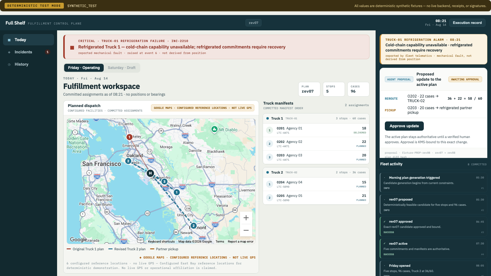
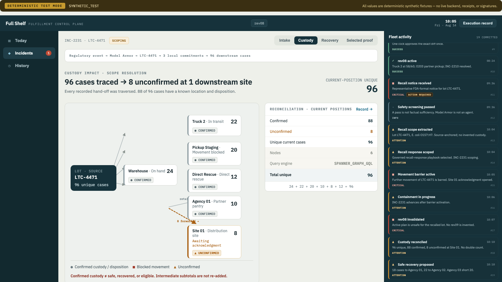

# Full Shelf — Food-Bank Fulfillment Control Plane

A refrigeration unit fails at 08:21 on a Friday morning, and 42 cases of food already committed to three agencies are suddenly unassignable. An hour later an FDA recall arrives for a lot that is already in trucks, on shelves, and past a second hand-off. Full Shelf is the control plane a food-bank operations director uses to repair that day: it proposes a specific plan revision, holds it behind one cryptographically-bound human approval, traces every affected case to its current physical position, and refuses to declare containment it cannot prove. Model reasoning is advisory throughout — only a deterministic ledger may change authoritative state, and it records a refusal as readily as a success.





## How it works

**Detect and propose.** Fleet telemetry reports a refrigeration fault on Truck 1. The orchestrator, running Google ADK agents over Gemini, reads the operating state and proposes a repair: Truck 2 absorbs O202's 22 cases (36 + 22 = 58 of 60 capacity), while O203's 20 cases become a refrigerated partner pickup. It cannot fit both — `36 + 22 + 20 = 78` exceeds 60, and the interface shows that arithmetic rather than hiding it. The agent proposes; it does not apply.

**Approve under binding.** The active plan `rev07` stays authoritative until a real human approves. Approval is KMS-bound to the exact diff: revision pair, both order actions and quantities, approver principal, plan-diff SHA-256, and key version. Altering any bound value invalidates the approval and produces zero mutations. Only on a verified approval does the deterministic plan ledger commit `rev07 → rev08`.

**Trace custody.** A recall lands for lot `LTC-4471`, hazard E. coli O157:H7. Spanner Graph traverses the same authoritative Spanner state to reconstruct where the cases physically are now: `24 + 22 + 20 + 10 + 8 + 12 = 96` unique cases across six custody nodes. Intermediate subtotals are not re-added and downstream sites are not double-counted, so the number is a position, not a sum of movements.

**Recover, and refuse the rest.** The ledger commits 40 safe replacement cases from lot `LTC-5090` — 18 to Agency 01, 22 to Agency 02. Agency 03 keeps a truthful 20-case shortfall rather than being filled with stock the evidence does not support. Eight cases remain unconfirmed at one downstream site, so the closure request is **refused** and the incident terminates at `PARTIALLY_CONTAINED`. The refusal is committed as a receipt with zero domain mutations: a governance outcome, not an agent failure.

## Run locally

The full product runs offline against a deterministic replay of the canonical Friday. No Google Cloud credentials, API keys, or billing are required for this path — every command below was run to produce the output shown.

### Prerequisites

- **Python 3.11+** (tested on 3.14.5)
- **Node.js 18+** (tested on v25.2.1) and npm (tested on 11.6.2)
- Two free local ports: **8788** (replay runtime) and **5173** (web client)
- A Google Maps browser key is **optional**. Without one the map falls back to a deterministic SVG schematic, and the test suite exercises that path deliberately.

### Install

```bash
git clone https://github.com/markbrazinski/full-shelf.git
cd full-shelf
python3 -m venv .venv
.venv/bin/python -m pip install -e packages/domain -e packages/observability \
  -r apps/plan-ledger/requirements.txt -r apps/orchestrator/requirements.txt
npm --prefix apps/web install
```

The fastest proof the code works, before starting anything:

```bash
PYTHONPATH=packages/domain:packages/observability:apps/orchestrator/src:apps/plan-ledger/src \
  .venv/bin/python -m pytest -q packages/domain/tests packages/contracts/tests tools/replay
# 540 passed, 1281 warnings in 5.04s
```

Run this from the repository root. The root `conftest.py` forces every test onto a
named isolated audit database, and pytest only loads it when the root is the
rootdir — invoking a subdirectory directly bypasses that safety boundary.

### Start

Two processes, in two shells.

```bash
# shell 1 — deterministic replay runtime, binds 127.0.0.1:8788
.venv/bin/python tools/replay/runtime_server.py
```

```
DETERMINISTIC TEST MODE - golden runtime on http://127.0.0.1:8788
  synthetic session replay. no Gemini, ADK, Model Armor, KMS, Spanner, or ledger.
```

```bash
# shell 2 — operator client, binds 127.0.0.1:5173
VITE_DATA_SOURCE=deterministic_replay VITE_ORCHESTRATOR_URL=http://127.0.0.1:8788 \
  npm --prefix apps/web run dev -- --host 127.0.0.1 --port 5173
```

```
  VITE v5.4.21  ready in 112 ms

  ➜  Local:   http://127.0.0.1:5173/
```

Open <http://127.0.0.1:5173>. The screen opens on the Friday operating plan at
`rev07`, under a persistent `DETERMINISTIC TEST MODE · SYNTHETIC_TEST` banner.
Press **→** to advance one event, **Space** to autoplay. The run pauses at the
refrigeration failure and waits: **Approve update** is the one human gate, and
nothing commits until you press it. Later, **Open Incidents** starts the recall,
which likewise holds for the operator rather than running past them.

### Expected health checks

```bash
curl -s http://127.0.0.1:8788/api/v1/replay/events | head -c 150
```

```
{"scenario_id": "full-shelf-friday-2026-08-14", "classification": "SYNTHETIC_TEST", "initial_cursor": 5, "human_gate": 9, "events": [{"sequence": 1,
```

```bash
curl -s http://127.0.0.1:5173 | grep -o "<title>.*</title>"
```

```
<title>Full Shelf — Fulfillment Control Plane</title>
```

### Shutdown

Ctrl-C in each shell. Nothing persists: replay sessions are in-memory and reach no cloud service.

## Technologies and dependencies

- **Google Cloud Spanner 3.40+** — authoritative relational operational state. The only store that may hold plan, custody, and receipt truth.
- **Spanner Graph (GQL)** — custody traversal over that *same* authoritative state, not a second store. Produces the `96` current-position reconciliation.
- **Google ADK 2.6.1 over Gemini** — advisory agent reasoning: reads state, extracts recall scope, proposes a repair. Structurally incapable of mutating authoritative state.
- **Model Armor** — managed untrusted-input boundary on the regulatory notice before any agent reads it. A screening pass is not factual sufficiency, and the UI says so.
- **Cloud KMS 3.0+** — signs and verifies the approval envelope binding the exact plan diff. Any altered bound value invalidates approval.
- **FastAPI + Uvicorn on Cloud Run** — two services only: `full-shelf-orchestrator` (read-only, advisory) and `full-shelf-plan-ledger` (deterministic, the sole mutator).
- **React 18.3 + TypeScript 5.6 + Vite 5.4** — the operator client. Renders committed state and the one approval gate; holds no authority of its own.
- **Google Maps JavaScript API** — planned-dispatch geography over configured reference locations. Not live GPS, and labelled as such in the product.
- **Playwright 1.62** — 58 end-to-end tests driven against the real replay server and a real Vite build, never a mock.

## Verification

Deterministic and unit suites, offline, no credentials:

```bash
PYTHONPATH=packages/domain:packages/observability:apps/orchestrator/src:apps/plan-ledger/src \
  .venv/bin/python -m pytest -q packages/domain/tests packages/contracts/tests tools/replay
# 540 passed
```

End-to-end operator journey, against the running replay runtime on 8788:

```bash
VITE_ORCHESTRATOR_URL=http://127.0.0.1:8788 npm --prefix apps/web test
# 58 passed (6.5m)
```

Type check and production build:

```bash
npm --prefix apps/web run typecheck   # clean
npm --prefix apps/web run build       # ✓ built in 402ms
```

The replay contract tests are the load-bearing ones: they fail if the committed
fixtures and the real production handler's response shape diverge, which is the
only thing that makes offline development against replay honest.

These suites prove deterministic behavior and contract shape. They do **not**
prove live Gemini, Model Armor, KMS, or Spanner integration — that requires the
deployed environment and real credentials.

## Repository structure

```
apps/
  orchestrator/     ADK + Gemini read-only coordination service (Cloud Run)
  plan-ledger/      deterministic, policy-checked sole mutator (Cloud Run)
  web/              React operator client; e2e/ holds the Playwright suite
packages/
  domain/           shared domain model, policy, and agent runtime
  contracts/        OpenAPI + JSON schemas for the accepted contract
  observability/    tracing and structured receipts
tools/replay/       offline deterministic runtime + committed fixtures
infra/spanner/      authoritative schema
docs/
  adr/              ten accepted architecture decision records
  build-reports/    builder testimony (non-authoritative, per AGENTS.md)
AGENTS.md           the repository's implementation constitution
```

## Sample outputs

- [Canonical runtime projections](docs/frontend/runtime-samples/) — the exact JSON the client renders at each event, including the denied-approval and refused-closure frames.
- [Golden journey screenshots](apps/web/e2e/screenshots/golden/) — twelve captured states from the verified end-to-end run.
- [Replay fixtures](tools/replay/fixtures/) — the committed deterministic timeline.
- [Golden demo event contract](docs/strategy/GOLDEN_DEMO_EVENT_CONTRACT.md) — the 25-event table the runtime sequences.

## License

[Apache License 2.0](LICENSE).

## Honest boundaries

- **All demonstrated data is synthetic.** The replay path is classified `SYNTHETIC_TEST` and the product says so on every screen. Agencies, lots, trucks, and the FDA-format notice are fabricated for demonstration. Nothing here is a real recall or a real food bank's operations.
- **Replay is not a recorded execution.** Fixtures are produced by driving the real production handler against a faked snapshot, so the response *shape* is real while the values are not. It must never be used for precision, recall, or ablation claims.
- **Approval in replay is synthetic** and claims no real authentication, KMS signature, or human identity. The genuine KMS binding lives in the ledger service and requires the deployed environment.
- **The map shows configured reference locations, not live GPS.** No operational affiliation with the named East Bay facilities is claimed.
- **Full Shelf is not a WMS, TMS, or route planner**, and does not replace one. It does not drive trucks, contact agencies, execute recalls, or make regulatory determinations.
- **It will refuse rather than resolve.** The canonical scenario ends at `PARTIALLY_CONTAINED` with eight cases unconfirmed and a 20-case shortfall standing. That is the intended outcome, not an incomplete demo.
